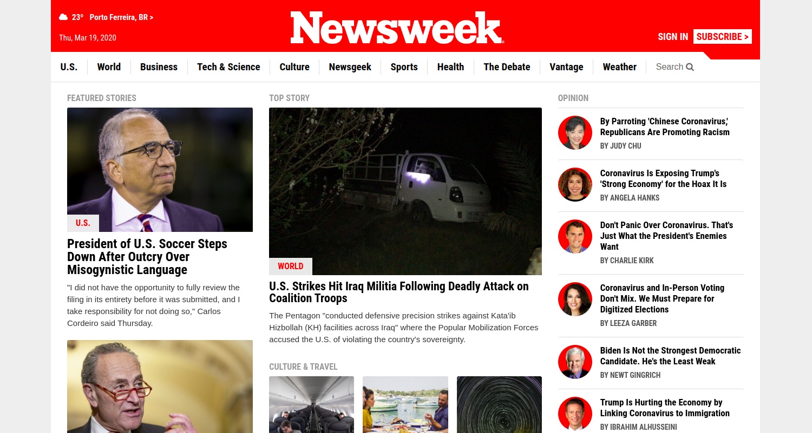

# Clone - "Newsweek" Website

> This is a clone of ["Newsweek" Website (TNW)](https://www.newsweek.com/), created to practice responsive layouts with bootstrap and media queries using a mobile first approach.

## Features

- Responsive layout: support to different screen sizes
- Positioning using bootstrap, flex and grid
- Single elements represented as cards
- Images alignment
- Google fonts imports
- Icons from fontawesome.com

## Built With

- HTML5
- CSS3: Media Queries, Flexbox, Positioning
- Bootstrap: Grid System, Styling, Positioning

## Live Demo

["Newsweek" Website Clone](https://newsweek-bootstrap-clone.netlify.com/)

## 👤 Author 

- Github: [@flpfar](https://github.com/flpfar)
- Twitter: [@flpfar](https://twitter.com/flpfar)
- Linkedin: [Felipe Augusto Rosa](https://www.linkedin.com/in/felipe-augusto-rosa-7b96a4b1)

## 🤝 Contributing

Contributions, issues and feature requests are welcome!

Feel free to check the [issues page](issues/).

## Show your support

Give a ⭐️ if you like this project!